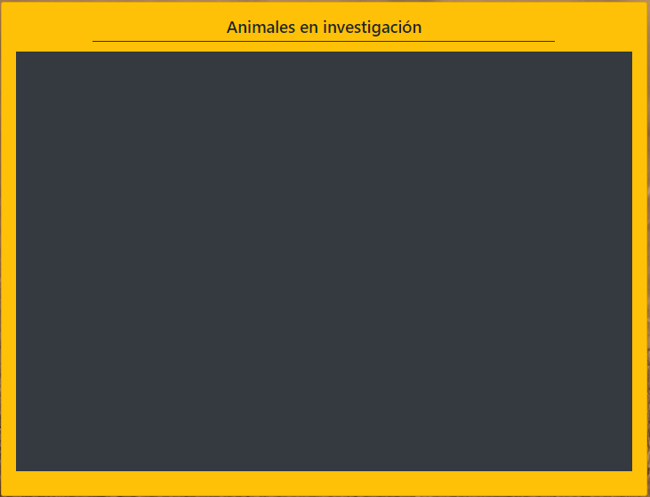
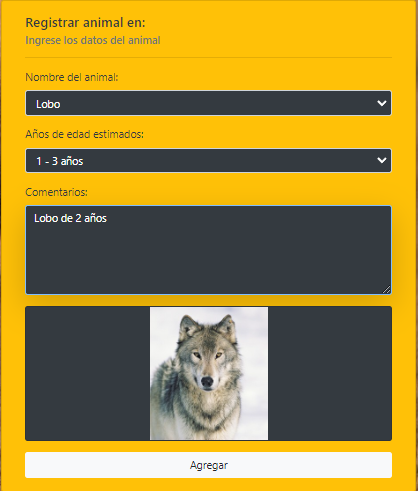
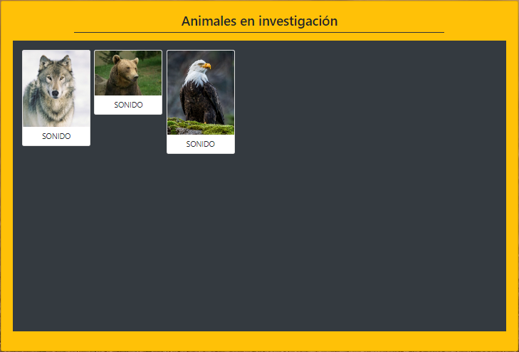
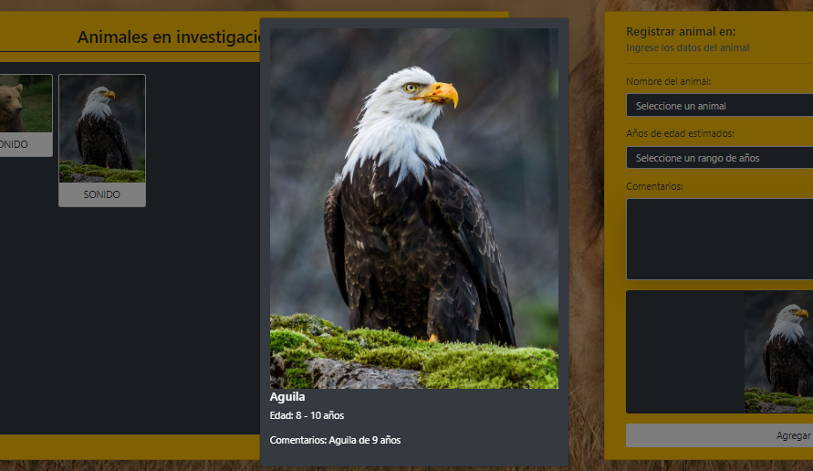

# Página Web, Registro de animales Salvajes

Proyecto de registro de animales salvajes, se registran datos y comentarios de los investigadores.

## Descripción

NOTA IMPORTANTE: Este es un desafio para el curso FullStack Javascript Trainee v2.0, dictado por DesafioLatam.

En este desafio se realiza un programa para registrar los comentarios de los investigadores acerca de los animales salvajes. Esta aplicación web permite agregar en una tabla 
los animaes que se van agregando, se utiliza POO para crear instancias que representen estos animales, con sus respectivos atributos y métodos necesarios para el funcionamiento
de la aplicación web.
Se agregan además funcionalidades de sonido, donde se reproduce el sonido característico de cada animal, así como un modal que muestra información en detalle (Animal, edad, comentario) del animal seleccionado.

## Visuales

En esta página web tenemos dos cosas importantes, el formulario y la tabla. 



El formulario nos pide datos que debemos agregar, cuando seleccionamos el Nombre del animal, enseguida podemos previsualizar una imagen en la sección final del formulario.


Al seleccionar agregar, la tabla va a ir obteniendo los animales agregador, como podemos ver a a continuación:


Finalmente podemos seleccionar uno de los animales, desplegar un modal y obtener más detalles de dicho animal.


Para cerrar el modal, solo debes hacer click fuera del modal.

## Empezando 🚀

Estas instrucciones te guiarán para obtener una copia de este proyecto en funcionamiento en tu máquina local para propósitos de desarrollo y pruebas.

### Prerrequisitos 📋

Lista de software y herramientas, incluyendo versiones, que necesitas para instalar y ejecutar este proyecto:

- Sistema Operativo: puedes usar Ubuntu 20.04 o Windows 10 
- Se trabajo con Javascript, html, css y jquery

### Instalación 🔧

Deberás clonar este repositorio en tus archivos, de esta manera:

```bash
# git clone git@github.com:jesbell/M4-U3-AnimalesSalvajes.git
```
Con eso podrás tenerlo en tu espacio de trabajo


## Construido Con 🛠️

- [Bootstrap](https://getbootstrap.com/) - Framework de CSS
- HTML, CSS, Javascript, jQuery

## Soporte

Si tienes algún problema o sugerencia, por favor abre un problema [aquí](https://github.com/jesbell/M4-U3-AnimalesSalvajes/issues).

## Versionado 📌

Usamos [Git](https://git-scm.com) para el versionado.

## Expresiones de Gratitud 🎁

Si encontraste cualquier valor en este proyecto o quieres contribuir, aquí está lo que puedes hacer:

- Comparte este proyecto con otros
- Invítanos un café ☕
- Inicia un nuevo problema o contribuye con un PR
- Muestra tu agradecimiento diciendo gracias en un nuevo problema.

---

⌨️ con ❤️ por [Joselyn Gonzaléz](https://github.com/jesbell) 😊
